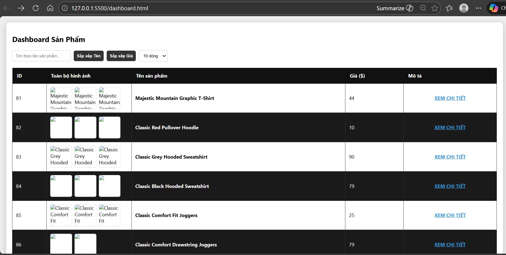
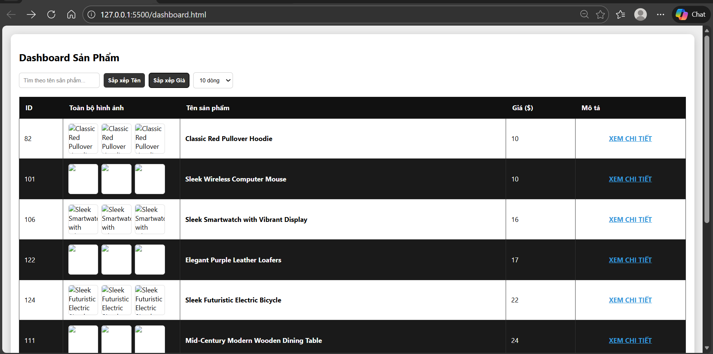
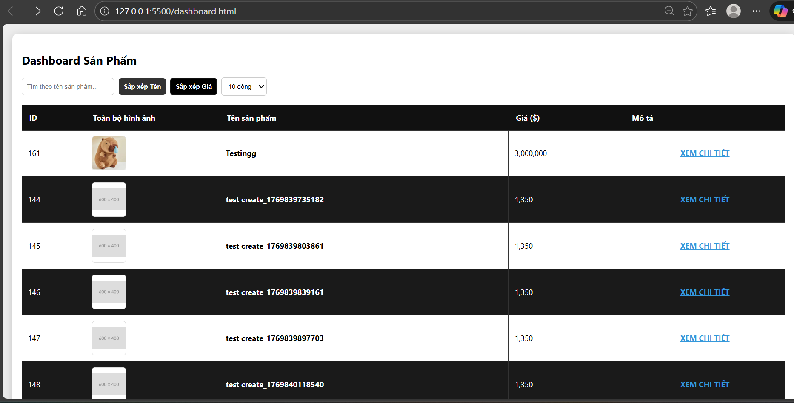
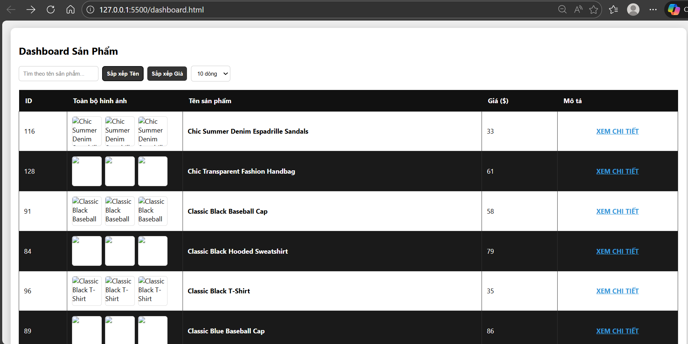
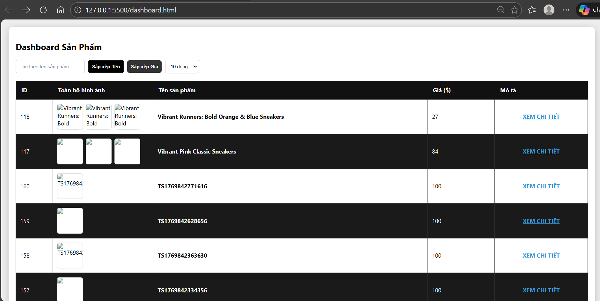
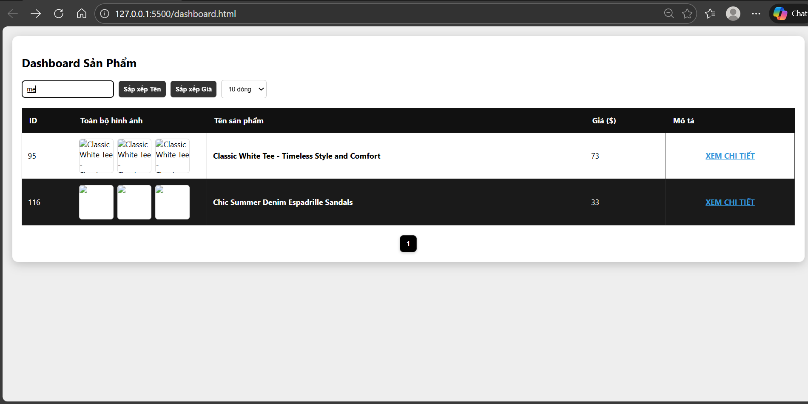
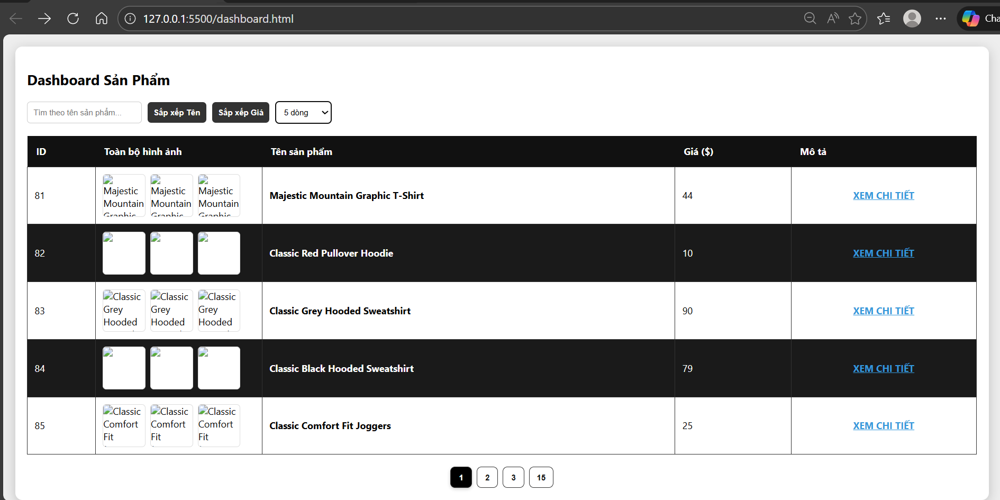
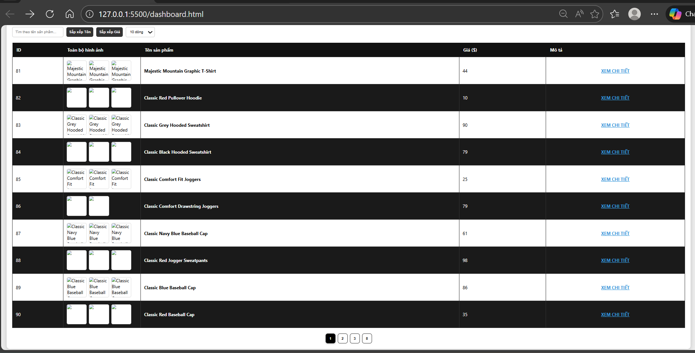
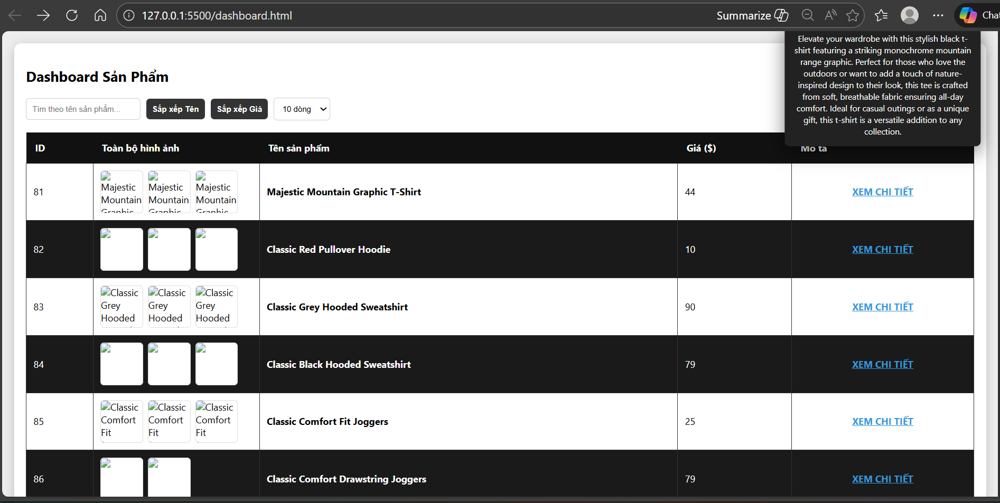

# DaoThanhDuy_2280600432-NNPTUD-C2

# Bài tập sử dụng API sau: https://api.escuelajs.co/api/v1/products, chỉ cần viết hàm getall của dashboard

## Ảnh chụp màn hình dự án
## 1. Trang tổng

### 2. Sắp xếp dữ liệu (Sorting)
* **Giá tăng dần:** Sắp xếp sản phẩm từ giá thấp đến cao.

* **Giá giảm dần:** Sắp xếp sản phẩm từ giá cao xuống thấp.

* **Tên sản phẩm (A-Z):** Sắp xếp tên từ trên xuống dưới theo bảng chữ cái.

* **Tên sản phẩm (Z-A):** Sắp xếp tên từ dưới lên trên theo bảng chữ cái.

### 3. Tìm kiếm thông minh (Search onChange)
* **Cơ chế:** Lọc dữ liệu ngay lập tức theo tiêu đề (Title) khi người dùng đang nhập vào ô tìm kiếm (sự kiện `oninput`).

### 4. Chia trang linh hoạt (Pagination)
Người dùng có thể thay đổi số lượng dòng hiển thị để dễ dàng quản lý:
* **Hiển thị 5 dòng/trang:**

* **Hiển thị 10 dòng/trang:**

### 5. Chi tiết mô tả (Hover Effect)
* **Mô tả:** Để bảng gọn gàng, cột mô tả chỉ hiển thị nội dung chi tiết dưới dạng Popup khi người dùng di chuột (Hover) vào ô tương ứng.

## Cách chạy dự án
1. Tải toàn bộ thư mục về máy.
2. Mở file `dashboard.html` bằng trình duyệt (Chrome, Edge, Firefox).